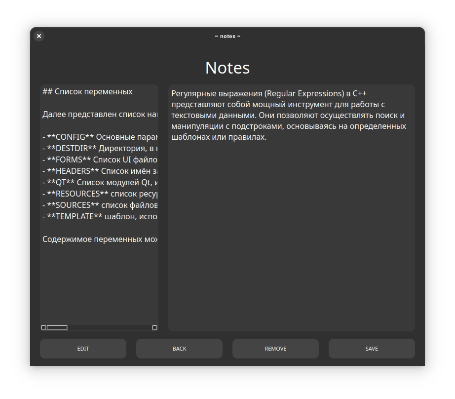
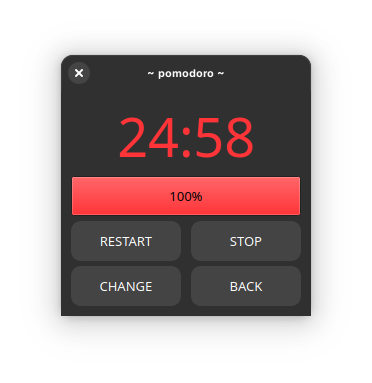
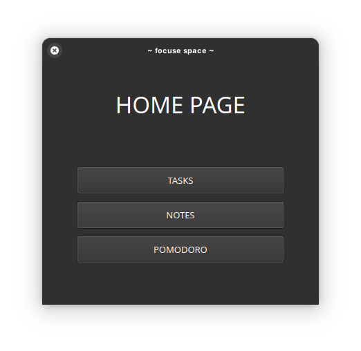
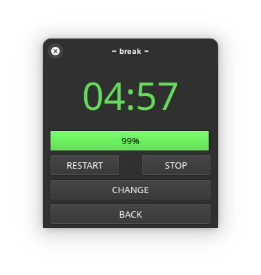

<h1 align="center">Cubes</h1>
<p align="center">Simple geometry game</p>
<br>

<div class="badges" align="center">
    <a href="https://github.com/Night3098/" target="_blank" rel="noreferrer">  </a>
    <a href="https://github.com/Night3098/" target="_blank" rel="noreferrer">  </a>
</div>
<br>
<div class"screenshots" align="center">
    </img>
    </img>
    </img>
    </img>
</div>
<br>
<h1 align="center">Installing</h1>

<a href=""><p align="center">!!! For the app to work, you need to install QT !!!</a></p>

```
git clone https://github.com/night3098/FocuseWorkspaceApp
cd FocuseWorkspaceApp
bash build.sh
chmod +x src/FocuseSpace/FocuseSpace
./src/FocuseSpace/FocuseSpace
```

The compiled program is located at the path FocuseWorkspaceApp/src/FocuseApp/FocuseSpace